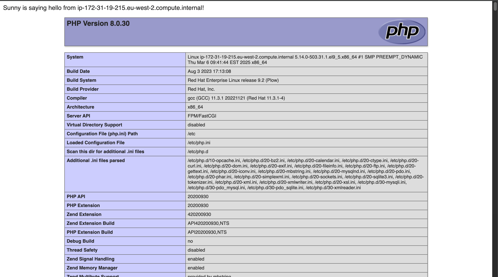

# RHEL LAMP Project

This project provisions a LAMP stack (Linux, Apache, MariaDB, PHP) on two Red Hat Enterprise Linux (RHEL) 9 instances in AWS. Using Terraform for infrastructure and Ansible for configuration, it demonstrates an infrastructure-as-code (IaC) approach across four milestones, culminating in a dynamic PHP page.


  
*Dynamic PHP page served from `http://3.8.115.251/index.php`*


## Purpose

The project automates the deployment of two RHEL instances in AWS, registers them with Red Hat, and configures a LAMP stack. It serves a PHP page (`index.php`) displaying “Sunny is saying hello from <hostname>!” and `phpinfo()`, showcasing:
- Cloud provisioning with Terraform.
- Configuration management with Ansible.
- RHEL-specific features like subscription handling and SELinux.


## Tech Stack

- **RHEL 9**: Offers enterprise-grade stability and practical experience with subscription workflows.
- **Terraform**: Enables declarative, repeatable AWS resource creation (EC2, security groups).
- **Ansible**: Provides agentless configuration via SSH, leveraging roles and Vault for modularity and security.
- **AWS**: Delivers a scalable cloud environment with public IP access for demonstration.
- **Git**: Facilitates version control, tracking project milestones, and collaboration via a GitHub repository.


## Project Structure

<details>
<summary>View Layout</summary>

```text
rhel-lamp-project/
├── terraform/ 📂  - AWS infrastructure files
├── ansible/   📂  - Configuration playbooks and roles
├── .gitignore 📜  - Excludes sensitive files
└── README.md  📝  - Project overview
```
</details>


## Milestones

1. **Setup**: Initialized Git repository with `.gitignore` and `README.md`.
2. **Infrastructure**: Terraform provisions two RHEL instances with SSH and HTTP access.
3. **Subscription**: Ansible registers instances with Red Hat and enables repositories.
4. **LAMP Stack**: Ansible role deploys Apache, MariaDB, PHP, secures MariaDB, and serves a PHP page.


## Requirements

- AWS account with EC2 access and a key pair.
- Red Hat Developer subscription (free at [developers.redhat.com](https://developers.redhat.com)).
- Terraform (`brew install terraform` on macOS).
- Ansible with `community.general` collection (`ansible-galaxy collection install community.general`).
- Python with `PyMySQL` (see Common Issue).


## Deployment Steps

1. **Clone the Repository**
   ```bash
   git clone https://github.com/sunnynwosu/rhel-lamp-project
   cd rhel-lamp-project


2. **Configure Terraform**  
- Edit `terraform/terraform.tfvars` with region, RHEL AMI, and key name, then deploy:
```bash
cd terraform
terraform init
terraform apply -var-file=terraform.tfvars
```

3. **Configure Ansible**  
- Update `ansible/hosts.yml` with IPs from `terraform output instance_ips`.  
- Create `ansible/vault.yml`:

```bash
ansible-vault create ansible/vault.yml
```
Add: `rhsm_username`, `rhsm_password`, `mysql_root_password`.  
- Execute:  
```bash
ansible-playbook -i ansible/hosts.yml ansible/playbooks/subscribe.yml --ask-vault-pass
ansible-playbook -i ansible/hosts.yml ansible/playbooks/lamp.yml --ask-vault-pass
```

4. **Verify**: Visit `http://<ip>/index.php`.

5. **Cleanup**:
    ```bash
    cd terraform
    terraform destroy -var-file=terraform.tfvars


#### Common Issue

**❌ Error**:
```text
FAILED! => {"changed": false, "msg": "A MySQL module is required: for Python 2.7 either PyMySQL, or MySQL-python, or for Python 3.X mysqlclient or PyMySQL..."}
```

**Solution**:

- **Standard Fix**: Install `PyMySQL` on your control node (e.g., Mac):
    ```bash
    pip3 install PyMySQL
    ```

- **Alternate Fix**: If the issue persists, install it on RHEL instances:
    ```bash
    ansible all -i ansible/hosts.yml -m command -a "dnf install -y python3-PyMySQL" -b
    ```
    
    *Note:* Typically, PyMySQL is needed on the control node, but installing on targets resolved it here—likely due to Python interpreter delegation.


```markdown
## Author  
Sunny Nwosu — [LinkedIn](https://www.linkedin.com/in/sunny-nwosu)

## Acknowledgments  
This project was developed to demonstrate RHEL automation using Terraform and Ansible.  
Feedback, suggestions, and contributions are always welcome.
